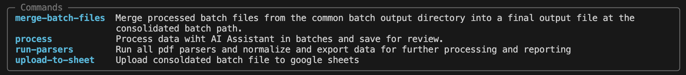
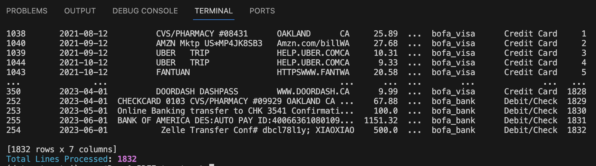
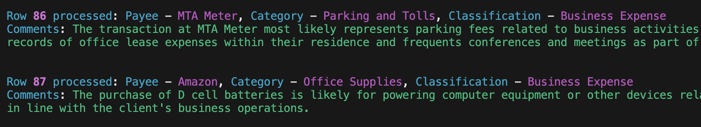

# PDF Transaction Extractor

A powerful tool for extracting, categorizing, and analyzing financial transactions from PDF statements using AI.

## Features

- **Multi-Format Support**: Handles various PDF statement formats
- **AI-Powered Categorization**: Intelligent transaction classification
- **Multi-Client Support**: Manage multiple client accounts
- **Google Sheets Integration**: Export data to spreadsheets
- **Custom Category Management**: AI-assisted category creation and management
- **Business Context Awareness**: Industry-specific categorization

## Installation

1. Clone the repository:
```bash
git clone https://github.com/yourusername/PDF-extractor.git
cd PDF-extractor
```

2. Create and activate a virtual environment:
```bash
python -m venv venv
source venv/bin/activate  # On Windows: venv\Scripts\activate
```

3. Install dependencies:
```bash
pip install -r requirements.txt
```

4. Set up environment variables:
```bash
cp .env.example .env
# Edit .env with your API keys and settings
```

## Usage

### Command Line Interface

The CLI provides an interactive menu system for managing clients and processing documents. To start:

```bash
python main.py
```

This will present you with the following options:
1. Client Management
   - Create new client
   - List clients
   - Update client
   - Delete client
   - Manage categories
   - Enhance business profile
2. Process Documents
3. Categorize Transactions
4. Upload to Google Sheets
5. Google Sheets Setup

### Supported Document Types

Place your PDF files in the appropriate input directories:
```
data/clients/<client_name>/input/<parser_type>/
```

Available parser types:
- `amazon` - Amazon order invoices
- `bofa_bank` - Bank of America bank statements
- `bofa_visa` - Bank of America credit card statements
- `chase_visa` - Chase Visa credit card statements
- `wellsfargo_bank` - Wells Fargo bank statements
- `wellsfargo_mastercard` - Wells Fargo Mastercard statements
- `wellsfargo_visa` - Wells Fargo Visa statements
- `wellsfargo_bank_csv` - Wells Fargo bank CSV exports
- `first_republic_bank` - First Republic bank statements

### Client Configuration

Each client needs a configuration file at `data/clients/<client_name>/client_config.yaml`:

```yaml
business_type: "Business Type"
business_details:
  industry: "Industry"
  business_activities: ["Activity 1", "Activity 2"]
  typical_expenses: ["Expense 1", "Expense 2"]
  location: "Location"
  annual_revenue: "Revenue Range"
custom_categories: []
```

## Development

### Project Structure

```
dataextractai/
├── agents/           # AI agents for different tasks
├── cli/             # Command-line interface
├── parsers/         # PDF parsing modules
├── utils/           # Utility functions
└── __init__.py
```

### Running Tests

```bash
pytest
```

## Contributing

1. Fork the repository
2. Create a feature branch
3. Commit your changes
4. Push to the branch
5. Create a Pull Request

## License

This project is licensed under the MIT License - see the LICENSE file for details.

# DataExtractAI

## Overview
DataExtractAI comes in two versions:
1. **Command-Line Version (Original/Stable)**: Parser-based approach for specific financial institutions
2. **Vision Version (Experimental)**: Uses GPT-4 Vision for universal document support

# Command-Line Version

## Introduction
The original `DataExtractAI` is a robust tool for parsing various financial documents and classifying transactions using advanced AI techniques. It streamlines the process of extracting data from PDFs, such as bank statements and credit card invoices, and uses AI to intelligently categorize transactions, aiding in financial analysis and reporting.

## Features
- Parses multiple PDF document types, including bank statements and credit card invoices.
- Includes parsers for Amazon, Bank of America, Chase, and Wells Fargo documents.
- Integrates with the OpenAI API to leverage AI models for transaction classification.
- Outputs structured data in CSV format for easy integration with financial systems.
- Uplaods to Google Sheets for display and formatting

## Getting Started

### Prerequisites
- Python 3.x
- pip

### Installation
Clone the repository to your local machine:
```bash
git clone https://github.com/yourusername/PDF-Extractor.git
```

Navigate to the project directory and install the necessary packages:
```bash
pip install -r requirements.txt
```

OR 

Conda environment setup:
```bash
conda env create -f environment.yml
```

OR 

## Alternative for one step set up of the Environment
To set up the required environment:

1. Install [Anaconda or Miniconda](https://docs.conda.io/projects/conda/en/latest/user-guide/install/index.html) if you haven't already.
2. Clone the repository and navigate to the project directory.
3. Run `conda env create -f environment.yml` to create a new Conda environment with all the required dependencies.
4. Activate the new environment using `conda activate <env_name>`.


### File Structure
```
├── README.MD
├── conda-requirements.txt
├── data
│   ├── input
│   │   ├── amazon
│   │   ├── bofa_bank
│   │   ├── bofa_visa
│   │   ├── chase_visa
│   │   ├── client_info
│   │   ├── wellsfargo_bank
│   │   └── wellsfargo_mastercard
│   └── output
│       ├── batch_outputs
│       └── state.json
├── dataextractai
│   ├── __init__.py
│   ├── classifiers
│   │   ├── __init__.py
│   │   └── ai_categorizer.py
│   ├── parsers
│   │   ├── __init__.py
│   │   ├── amazon_parser.py
│   │   ├── bofa_bank_parser.py
│   │   ├── bofa_visa_parser.py
│   │   ├── chase_visa_parser.py
│   │   ├── run_parsers.py
│   │   ├── wellsfargo_bank_parser.py
│   │   └── wellsfargo_mastercard_parser.py
│   └── utils
│       ├── __init__.py
│       ├── config.py
│       ├── data_transformation.py
│       └── utils.py
├── directory_structure.txt
├── environment.yml
├── requirements.txt
├── pyproject.toml
├── requirements.txt
├── scripts
│   ├── __init__.py
│   └── grok.py
├── setup.py
└── tests
    ├── __init__.py
    ├── print_samples.py
```

## Usage

All commands have a help function which can be invoked with '--help'. The main script is:
```bash
python scripts/grok.py --help
```


To use `DataExtractAI`, place your PDF documents in the appropriate `data/input` statement directories (parsers are updated as of November, 2023 statement formats) and run the appropriate parser script directly or you can run all parsers at once using the command:

```bash
python scripts/grok.py run-parsers
```

The transactions will be saved individually in their original column formats and also transformed, merged and saved in the `data/output` directory as CSV file (consolidated_core_output.csv):



Use the AI classifier command to  categorize, classify, and justify each transaction for bookkeeping purposes. It's currently set up to use a bookeeper AI Assistant (AmeliaAI) using Open AI model 3.5 Turbo - 1106 which works well for simple transactions and is cost effective. For more complex transactions you can pass in the assistant '-- ai_name DaveAI' which is set up to gpt4-turbo and has a more extensive CPA system prompt. For best results create a client text file in the inputs/client_info folder which describes your personal business or job situation, marital status, any tools or expenses which are typically used in your business or craft. This will help AI consider whether they are personal or business expenses for tax purposes classificaiton.

You can adjust the AI batch size processing by adding --batch-size 
This ensures that AI processed files are saved in batches in case there is a break in connectivity with Open AI and don't want to re-process them and incur added expenses.

```bash
python scripts/grok.py process
```

 Sample output from AI batch rocessing:



After reviewing the batch files you can merge them into one consolidated file (consolidated_batched_output.csv) or merge directly without reviewing using the command process --merge-directly:

```bash
python scripts/grok.py merge-batch-files
```

To use the google sheets uploader be sure to export your google sheets auth key"

'export GOOGLE_SHEETS_CREDENTIALS_PATH = xxxx'

and the Sheet identifier which you will be uplaoding to:

'export GOOGLE_SHEETS_ID = xxxx'

 The file will be named 'ExpenseReport' unless changed in the config.py:

```bash
python scripts/grok.py upload-to-sheet
```

## Built With
- Python 3 - The programming language used.
- OpenAI API - For leveraging AI models for classification.
- pdfplumber, Fitz, PyPDF2 - Libraries used for PDF processing.

## Contributing
Contributions are what make the open-source community such an amazing place to learn, inspire, and create. Any contributions you make are **greatly appreciated**.

## Versioning
We use [SemVer](http://semver.org/) for versioning. For the versions available, see the tags on this repository.

## Authors
- **Gregory Lindberg** - *Initial work* - [glindberg2000](https://github.com/glindberg2000)
- Updated on November 5, 2023

## License
This project is licensed under the Apache License 2.0 - see the [LICENSE](LICENSE) file for details.

## Contact
If you have any questions or suggestions, please feel free to contact us at [greglindbereg@gmail.com](mailto:greglindbereg@gmail.com).

## Acknowledgements
- OPENAI for breakthrough AI technology without which this coding could not have been completed, and all open source AI tools paving the way to massive productivity increases. 

# Vision Version (Experimental)

## Introduction
`DataExtractAI Vision` is a modernized tool that uses GPT-4 Vision to extract transaction data from any financial document format. This experimental version aims to eliminate the need for document-specific parsers.

## Features
- Universal PDF Support: Works with any financial document format
- AI-Powered Extraction: Uses GPT-4 Vision for accurate data extraction
- Automatic Transaction Categorization: Includes best-guess transaction categories
- Multi-Client Support: Organized structure for handling multiple clients
- Simple Interface: Easy-to-use command-line tools
- Batch Processing: Handle multiple documents efficiently
- Structured Output: Clean CSV format for easy integration

## Getting Started

### Prerequisites
- Python 3.8 or higher
- OpenAI API key with GPT-4 Vision access
- `poppler-utils` for PDF processing:
  - macOS: `brew install poppler`
  - Ubuntu: `apt-get install poppler-utils`
  - Windows: Download from [poppler releases](http://blog.alivate.com.au/poppler-windows/)

### Installation
1. Clone the repository:
```bash
git clone https://github.com/glindberg2000/PDF-extractor.git
cd PDF-extractor
```

2. Create and activate virtual environment:
```bash
# Create virtual environment
python -m venv venv

# Activate virtual environment
# On Windows:
venv\Scripts\activate
# On macOS/Linux:
source venv/bin/activate
```

3. Install the package:
```bash
pip install -e .
```

### Configuration
1. Set your OpenAI API key:
```bash
export OPENAI_API_KEY='your-api-key-here'
```
Or create a `.env` file:
```
OPENAI_API_KEY=your-api-key-here
```

## Setting Up a New Client

### 1. Create Client Directory
```bash
# Create new client directory from template
cp -r clients/_template clients/new_client_name
```

### 2. Configure Client Settings
1. Edit `clients/new_client_name/client_config.yaml`:
   - Update client information
   - Customize transaction categories
   - Set processing preferences

### 3. Prepare Document Directories
The client directory structure:
```
clients/
├── new_client_name/
│   ├── client_config.yaml
│   ├── input/           # Place PDF statements here
│   └── output/          # Processed results appear here
├── _template/           # Template for new clients
└── _examples/           # Example configurations
```

### 4. Process Documents
1. Place PDF statements in the client's input directory
2. Run the processor:
```bash
# Process a single file
dataextractai-vision process-file clients/new_client_name/input/statement.pdf --output clients/new_client_name/output

# Process all files in input directory
dataextractai-vision process-dir clients/new_client_name/input --output clients/new_client_name/output
```

## Example Client Setup
Check out the example client configuration in `clients/_examples/tech_consultant/` for a sample setup of a technology consulting business.

## Output Format
The tool generates CSV files with the following columns:
- `date`: Transaction date (YYYY-MM-DD format)
- `description`: Full transaction description
- `amount`: Transaction amount (negative for debits)
- `category`: Best-guess transaction category

Example:
```csv
date,description,amount,category
2024-03-14,AMAZON.COM PURCHASE,-29.99,Shopping
2024-03-15,DIRECT DEPOSIT SALARY,5000.00,Income
```

## Best Practices
1. Client Organization
   - Keep each client's data separate in their own directory
   - Use meaningful client directory names
   - Maintain client-specific configuration files

2. Document Management
   - Organize input documents by date or type
   - Regular backup of processed data
   - Review output files promptly

3. Configuration
   - Customize categories based on client's business
   - Adjust batch sizes based on document volume
   - Document any special processing requirements

## Contributing
Contributions are welcome! Please feel free to submit a Pull Request.

## License
This project is licensed under the Apache License 2.0 - see the [LICENSE](LICENSE) file for details.

## Contact
For questions or suggestions, please contact [greglindbereg@gmail.com](mailto:greglindbereg@gmail.com).

## Acknowledgements
- OpenAI for the powerful GPT-4 Vision API
- The open-source community for various Python libraries
- All contributors and users of the project

## Client Data Structure

The project uses a standardized directory structure for client data:

```
data/clients/
├── _template/              # Template structure for new clients
│   ├── client_config.yaml  # Template configuration
│   ├── input/             # Input directories for different parsers
│   │   ├── amazon/
│   │   ├── bofa_bank/
│   │   ├── bofa_visa/
│   │   ├── chase_visa/
│   │   ├── first_republic_bank/
│   │   ├── wellsfargo_bank/
│   │   ├── wellsfargo_bank_csv/
│   │   ├── wellsfargo_mastercard/
│   │   └── wellsfargo_visa/
│   └── output/            # Processed output files
├── _examples/             # Example client setups
│   └── tech_consultant/   # Example for a tech consultant
└── [client_name]/         # Individual client directories
```

### Setting Up a New Client

1. Copy the `_template` directory to create a new client:
   ```bash
   cp -r data/clients/_template data/clients/new_client_name
   ```

2. Edit the `client_config.yaml` file to set:
   - Client name and type
   - Google Sheets configuration
   - Parser selection
   - AI processing settings
   - Custom categories

3. Place source documents in the appropriate input directories:
   - Bank statements in respective bank folders
   - Credit card statements in respective card folders
   - Ensure files are in supported formats (PDF, CSV)

### Client Configuration

The `client_config.yaml` file controls:
- Sheet names and IDs for Google Sheets export
- Which parsers to run for the client
- AI assistant selection and settings
- Custom categories for expense classification

See the example configurations in `data/clients/_examples/` for reference implementations.

## Parser Detection

All parsers are now detected by file content using each parser's `can_parse` method, not by filename. This makes the system robust to filename changes and future-proof for new statement types.

## Credit Card Amount Sign Convention

- Charges/Expenses/Debits: **Negative** (e.g., purchases, fees: `-149.88`)
- Credits/Payments/Income: **Positive** (e.g., payments, refunds: `+46.00`)

## Test Harness Improvements

The test harness now uses content-based detection for all parsers, ensuring that files are matched to the correct parser by their contents, not their filenames. This improves reliability and maintainability.

# Parser Development & Debugging Guide

## 1. Adding or Upgrading a Parser
- Use the modular, contract-based pattern (see existing parsers for reference).
- Implement a `can_parse` method for robust, content-based detection (do not rely on filename except as a last resort).
- Use a module-level logger (never assign `logger` inside functions).
- Ensure all required fields (dates, amounts, file_path, etc.) are always present in the output.
- Use the provided normalization helpers (e.g., `normalize_transaction_amount`) for sign conventions and field consistency.

## 2. Common Pitfalls & Gotchas
- **Logger Scoping:** Only use module-level loggers. Never assign `logger` inside a function. Name your logger uniquely (e.g., `wellsFargo_logger`).
- **Date Normalization:** Always extract the statement year/date from the PDF content (or filename as a fallback) and use it for all transaction/post dates. Do not guess or default to the current year.
- **Amount Sign Convention:**
  - Charges/Expenses/Debits: **Negative** (e.g., purchases, fees: `-149.88`)
  - Credits/Payments/Income: **Positive** (e.g., payments, refunds: `+46.00`)
  - Use `normalize_transaction_amount` for all credit card parsers.
- **Contract Compliance:** Output must be a valid `ParserOutput` (Pydantic) object. All fields must be present and correctly typed. No `None` for required fields.
- **Parser Detection:** Always implement and test `can_parse` for content-based detection. The test harness will use this to match files to parsers.
- **Debug Prints:** Remove all debug prints and extra logging before finalizing your PR.

## 3. Required Output Format
- Output must be a `ParserOutput` (Pydantic) object.
- Each transaction must be a `TransactionRecord` with all required fields.
- No missing or `None` values for required fields.
- The output must pass all contract tests.

## 4. Tests to Run
- **Contract Compliance:**
  - `pytest -v tests/test_parser_contracts.py` (ensures output matches required schema and conventions)
- **Integration/Batch:**
  - `pytest -v tests/test_all_parsers_on_folder.py` (runs all parsers on all sample files, checks detection and output)
- **Spot-Check Output:**
  - Use `scripts/dump_wfmc_csv.py` (or similar) to dump parser output to CSV for manual review.

## 5. Debugging & Spot-Checking
- If a parser is not detected, check its `can_parse` method and ensure it works on real file content.
- If all amounts are zero or have the wrong sign, check normalization logic and use the helpers.
- If dates are missing or wrong, ensure the statement year is extracted and used everywhere.
- If contract tests fail, check for missing fields, wrong types, or sign convention errors.
- Use CSV dumps to quickly review output for a sample file.

## 6. Final Checklist Before PR/Merge
- [ ] All debug prints/logs removed
- [ ] Output is contract-compliant (passes contract tests)
- [ ] Content-based detection works (passes integration tests)
- [ ] Amount sign convention is correct
- [ ] Dates are correct and use statement year
- [ ] README and any relevant docs/scripts are updated
- [ ] Team notified of any changes to conventions or detection logic

## 7. References & Scripts
- See `scripts/dump_wfmc_csv.py` for CSV spot-checking
- See `tests/test_parser_contracts.py` for contract tests
- See `tests/test_all_parsers_on_folder.py` for integration/batch tests
- See this README for sign conventions, detection logic, and best practices

---

*Keep this section up to date as new patterns, pitfalls, or best practices emerge!*

# OrganizerExtractor: Professional Tax Organizer PDF Pipeline

**What is it?**
- A modular pipeline for extracting Table of Contents (TOC), Topic Index, page thumbnails, and metadata from professional tax organizer PDFs (e.g., UltraTax, Lacerte, Drake).
- Not for standard bank/credit card statements.

**How to Use (Standalone):**
```bash
python3 -m dataextractai.parsers.organizer_extractor --pdf_path <input.pdf> [--output_dir <output_dir>] [--test_mode]
```
- By default, creates a timestamped output directory with all extracted files and a manifest.
- Use `--test_mode` to run only the merge logic using cached JSONs (for fast dev/testing).

**How to Use (as a Module):**
```python
from dataextractai.parsers.organizer_extractor import OrganizerExtractor
extractor = OrganizerExtractor(pdf_path, output_dir)
extractor.extract()  # Extracts TOC, splits pages, generates thumbnails
extractor.extract_topic_index_pairs_vision()  # Extracts Topic Index pairs using Vision LLM
output = extractor.merge_llm_toc_driven()  # Main output: list of dicts (see schema below)
```

**Auto-Detection (can_parse):**
```python
if OrganizerExtractor.can_parse(file_path):
    # Safe to use OrganizerExtractor on this file
```
- Returns True if the filename or first page contains 'Organizer' or 'Tax Organizer'.

**Registry Integration:**
If using a parser registry (see `parsers_core/registry.py`):
```python
from dataextractai.parsers.organizer_extractor import OrganizerExtractor
from dataextractai.parsers_core.registry import ParserRegistry
ParserRegistry.register_parser('organizer', OrganizerExtractor)
parser_name = ParserRegistry.detect_parser_for_file(file_path)
if parser_name == 'organizer':
    # Use OrganizerExtractor
```

**Output Schema:**
- The output is NOT the standard `ParserOutput` model. Instead, expect:
```json
{
  "page_number": 1,
  "toc_title": "Personal Information",
  "topic_index_match": {"form_code": "3", "description": "Personal Information"},
  "pdf_page_file": "page_1.pdf",
  "thumbnail_file": "thumb_1.png",
  "raw_text_file": "page_1.txt",
  "matching_method": "llm"
}
```
- Upstream consumers should handle this schema directly.

**For more details, see the docstring in `organizer_extractor.py`.**

